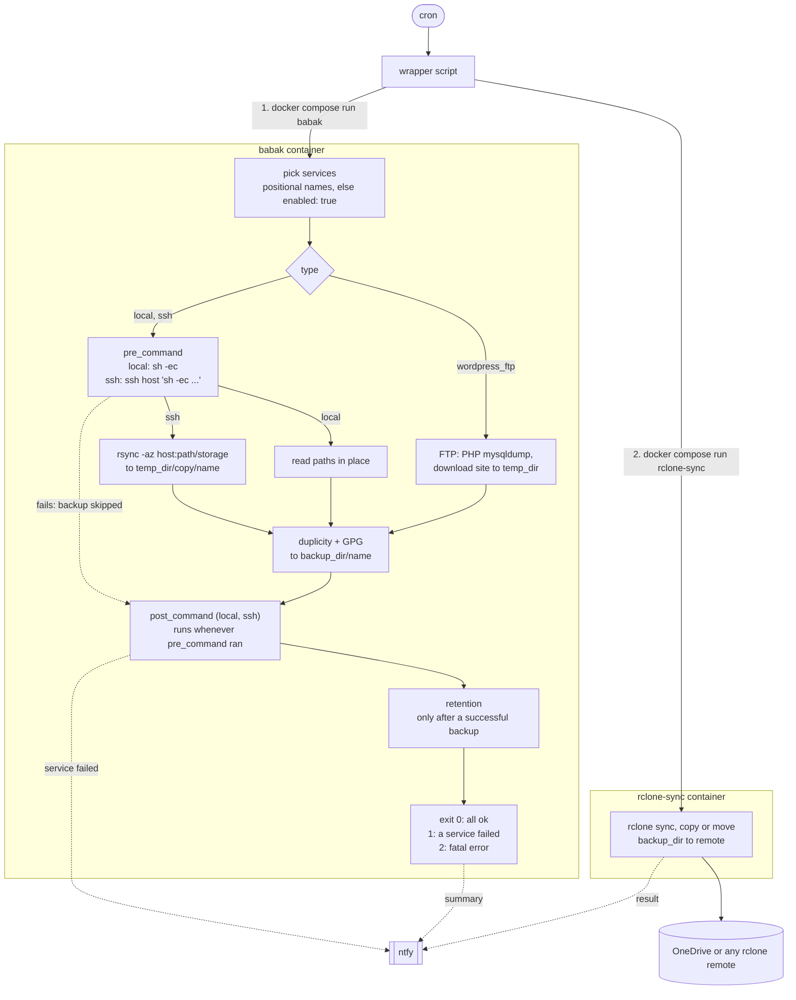

# Babak

Babak backs up services into encrypted, incremental [Duplicity](https://duplicity.us/) archives. It reads a YAML config, runs each service's backup, applies retention, and reports to [ntfy](https://ntfy.sh). A companion `rclone-sync` container pushes the archives to any [rclone](https://rclone.org/) remote.



## How it works

For each selected service, in config order:

| Type | Source | Steps |
|---|---|---|
| `local` | Paths on the machine running Babak (in Docker: read-only mounts) | `pre_command` (`sh -ec`), duplicity on `paths`, `post_command`, retention |
| `ssh` | A directory on a remote host, reached through an `~/.ssh/config` alias | `pre_command` on the host, `rsync -az` of each `storage` entry to `temp_dir/copy/<name>`, duplicity, delete the copy, `post_command` on the host, retention |
| `wordpress_ftp` | A WordPress site with only FTP access | Block `*.sql` in `.htaccess`, upload a PHP script that runs `mysqldump`, wait for `db.sql`, download the site, restore `.htaccess` and delete the dump, duplicity, retention |

Each service gets its own Duplicity chain in `backup_dir/<name>`, encrypted with `gpg_key`. A new full backup starts when the last one is older than `full_if_older_than`; every other run is incremental.

## Quick start

```bash
mkdir -p storage/{backups,ssh,rclone,tmp,duplicity-cache}
# write storage/config.yml (see Configuration), export the GPG keys (see GPG keys)
bun run validate:config storage/config.yml
docker compose -f docker-compose.prod.yml run --rm babak
```

## Configuration

Babak reads `./config.yml`, or the file passed with `-c` / `--config` (in Docker: the `CONFIG_FILE` variable). The schema lives in [`src/config.ts`](src/config.ts). Babak does **not** expand environment variables in the config: `${VAR}` stays literal, except inside `pre_command` / `post_command`, where the shell that runs the script expands it.

Durations use the Duplicity time format: `1D`, `2W`, `1M`, `6M`, `1Y`.

### `system` (optional)

| Key | Default | Description |
|---|---|---|
| `backup_dir` | `./backups` | Where the Duplicity chains go, one directory per service. Relative paths resolve from the working directory (`/workspace` in Docker, so set `/backups` there). |
| `temp_dir` | `/tmp/babak` | Scratch space for rsync copies and FTP downloads. |
| `gpg_key` | `$GPG_KEY` | GPG key ID used to encrypt. Without one, Babak warns and backs up unencrypted. |
| `ntfy.url`, `ntfy.topic` | | ntfy server URL and topic. Both required if `ntfy` is set. |
| `ntfy.username`, `ntfy.password` | | Basic auth, sent only when both are set. |
| `retention.full_backup_lifetime` | `6M` | Chains older than this are deleted. |
| `retention.incremental_lifetime` | `1M` | Logged only; it drives no command today. |
| `retention.keep_full_chains` | `1` | Chains that keep their incrementals. See [Retention](#retention). |
| `duplicity.full_if_older_than` | `1M` | Start a new full backup after this interval. |
| `duplicity.allow_source_mismatch` | `true` | Passes `--allow-source-mismatch`, needed because the container hostname changes between runs. |
| `rclone.enabled` | `false` | The `rclone` block is validated by Babak but used only by `rclone-sync`. |
| `rclone.remote` | | `remote-name:path`. Required if `rclone` is set. |
| `rclone.sync_command` | `sync` | `sync`, `copy` or `move`. |
| `rclone.flags` | | Extra rclone flags. |
| `rclone.exclude` | | rclone `--exclude` patterns. |
| `rclone.dry_run` | `false` | Adds `--dry-run`. |

### `services`

Common keys:

| Key | Default | Description |
|---|---|---|
| `name` | | Unique name, also the directory under `backup_dir` and the positional filter. |
| `type` | | `local`, `ssh` or `wordpress_ftp`. |
| `enabled` | `true` | Disabled services are skipped unless named on the command line. |

`local`:

| Key | Description |
|---|---|
| `paths` | Absolute paths to back up (duplicity `--include`, everything else excluded). |
| `exclude` | Duplicity `--exclude` globs, e.g. `**/node_modules`. |
| `pre_command`, `post_command` | Shell scripts run inside the Babak container. See [pre_command and post_command](#pre_command-and-post_command). |

`ssh`:

| Key | Description |
|---|---|
| `host.name` | Host alias from `~/.ssh/config`. |
| `host.path` | Remote base directory. Scripts run from it and `storage` is relative to it. |
| `storage` | At least one file or directory under `host.path` to copy. A leading `./` is stripped. |
| `exclude` | rsync `--exclude` patterns, applied to every `storage` entry. |
| `pre_command`, `post_command` | Shell scripts run on the host from `host.path`. |

`wordpress_ftp`:

| Key | Default | Description |
|---|---|---|
| `host_url` | | Public site URL; Babak requests `<host_url>/db-dump.php` to start the dump. |
| `ftp.host`, `ftp.user`, `ftp.password`, `ftp.dir` | | FTP access and the WordPress root. |
| `ftp.secure` | `false` | Use FTPS. |
| `database.host`, `database.user`, `database.password`, `database.name` | | Passed to `mysqldump` on the web host. |

### Full example

Every key, with placeholder values:

```yaml
system:
  backup_dir: /backups
  temp_dir: /tmp/babak
  gpg_key: "0123456789ABCDEF"
  ntfy:
    url: https://ntfy.example.com
    topic: my-backups
    username: babak
    password: change-me
  retention:
    full_backup_lifetime: 6M
    incremental_lifetime: 1M
    keep_full_chains: 2
  duplicity:
    full_if_older_than: 1M
    allow_source_mismatch: true
  rclone:
    enabled: true
    remote: "onedrive:babak"
    sync_command: sync
    flags:
      - "--transfers=4"
    exclude:
      - "*.tmp"
    dry_run: false

services:
  - name: app-files
    type: local
    enabled: true
    paths:
      - /data/app
    exclude:
      - "**/cache"
    pre_command: echo "starting app-files"
    post_command: echo "done app-files"

  - name: webapp
    type: ssh
    enabled: true
    host:
      name: server1
      path: /srv/webapp
    pre_command: |
      docker compose exec -T db sh -c 'pg_dump -U "$POSTGRES_USER" "$POSTGRES_DB"' > dump.sql
    storage:
      - ./dump.sql
      - ./uploads
    exclude:
      - "*.log"
    post_command: rm -f dump.sql

  - name: blog
    type: wordpress_ftp
    enabled: false
    host_url: https://blog.example.com
    ftp:
      host: ftp.example.com
      user: ftp-user
      password: change-me
      dir: /www
      secure: true
    database:
      host: db.example.com
      user: wp-user
      password: change-me
      name: wordpress
```

### Common patterns

The `docker compose` examples are `ssh` services: the Babak image has no Docker CLI, so run container commands on the host. `$VARS` inside single quotes expand in the container, so no password lands in the config.

Postgres dump, removed after the backup:

```yaml
- name: nextcloud
  type: ssh
  host: { name: server1, path: /srv/nextcloud }
  pre_command: |
    docker compose exec -T db sh -c 'pg_dump -U "$POSTGRES_USER" "$POSTGRES_DB"' > dump.sql
  storage: [./dump.sql, ./data]
  post_command: rm -f dump.sql
```

MariaDB dump:

```yaml
- name: wiki
  type: ssh
  host: { name: server1, path: /srv/wiki }
  pre_command: |
    docker compose exec -T db sh -c 'mariadb-dump -u root -p"$MARIADB_ROOT_PASSWORD" "$MARIADB_DATABASE"' > dump.sql
  storage: [./dump.sql, ./uploads]
  post_command: rm -f dump.sql
```

SQLite consistent copy (`.backup` is safe while the app writes; without `sqlite3` on the host, `docker compose stop app` in `pre_command` and `start` in `post_command` also work):

```yaml
- name: vaultwarden
  type: ssh
  host: { name: server1, path: /srv/vaultwarden }
  pre_command: sqlite3 data/db.sqlite3 ".backup 'data/db-backup.sqlite3'"
  storage: [./data]
  exclude: [db.sqlite3, db.sqlite3-wal, db.sqlite3-shm]
  post_command: rm -f data/db-backup.sqlite3
```

Multi-line `pre_command` where every line must succeed (errexit is already on; `set -e` only makes it explicit):

```yaml
- name: gitlab
  type: ssh
  host: { name: server1, path: /srv/gitlab }
  pre_command: |
    set -e
    docker compose exec -T gitlab gitlab-backup create STRATEGY=copy
    cp config/gitlab-secrets.json backups/
    chmod -R a+r backups
  storage: [./backups]
  post_command: rm -rf backups/*
```

Local type with read-only mounts. Mount each source into the Babak container, e.g. in a `docker-compose.override.yml`:

```yaml
services:
  babak:
    volumes:
      - /home/me/documents:/data/documents:ro
      - /etc/nginx:/data/nginx:ro
```

```yaml
- name: documents
  type: local
  paths: [/data/documents, /data/nginx]
  exclude: ["**/.git", "**/node_modules"]
```

## pre_command and post_command

- Both run with errexit: `sh -ec` locally, `ssh <host> "sh -ec '<cd host.path + script>'"` for `ssh`. The first failing line fails the script, whatever the remote login shell is. Quotes and `$VARS` reach the remote `sh` untouched.
- A failing `pre_command` fails the service: backup and retention are skipped, the per-service ntfy alert fires, and Babak exits 1.
- `post_command` runs whenever `pre_command` ran, even if it or the backup failed, so cleanup (`rm dump.sql`, `docker compose up -d`) still happens. With no `pre_command`, `post_command` does not run.
- A failing `post_command` is logged as an error but does not fail the service.
- Errexit ignores failures in the middle of a pipeline (`a | b` only checks `b`) and in `if`, `&&` or `||` conditions. Write `cmd > file` rather than `cmd | tee file` when the failure must count.

## Retention

After each successful backup, Babak runs on the service's chain:

1. `duplicity remove-older-than <full_backup_lifetime> --force`: drop chains older than 6 months (Duplicity never deletes a set a newer one depends on).
2. `duplicity remove-all-inc-of-but-n-full <keep_full_chains> --force`: keep incrementals only for the newest N chains; older chains shrink to their full backup.

With the defaults (full every month, 6 months kept) you get daily restore points in the recent chain(s) and monthly points back to 6 months.

**Caveat:** with `keep_full_chains: 1`, the run that starts a new full also deletes the previous chain's incrementals. Right after each monthly full, the daily window is one day (today's full), plus the older monthly fulls. Set `keep_full_chains: 2` for at least a full month of daily restore points at all times.

A retention failure does not fail the service: it shows as a warning in the ntfy summary.

## Running

```bash
docker compose -f docker-compose.prod.yml run --rm babak                  # all enabled services
docker compose -f docker-compose.prod.yml run --rm babak webapp wiki      # only these, even if disabled
docker compose -f docker-compose.prod.yml run --rm -e CONFIG_FILE=/workspace/other.yml babak
bun run index.ts -c config.yml webapp                                     # without Docker
```

Positional arguments are service names. An unknown name lists the available ones and exits 1.

Validate a config without running anything (prints each service and whether it is enabled):

```bash
bun run validate:config storage/config.yml
```

An invalid config also stops a real run with the Zod error tree and exit code 1.

### Exit codes

| Code | Meaning |
|---|---|
| `0` | Every selected service succeeded. Retention warnings do not change it. |
| `1` | At least one service failed, the config is invalid, or a positional name is unknown. |
| `2` | Fatal error outside a service. Babak tries to send a `FATAL` ntfy alert. |

### Notifications

With `ntfy` set, Babak sends:

- `Backup Failed: <name>` (high priority) as soon as a service fails;
- one summary at the end, `Backup Complete`, `Backup Complete (Retention Warnings)` or `Backup Completed with Errors`, with each service's size and error;
- `Backup Failed: FATAL` on exit code 2.

`rclone-sync` reuses the same `ntfy` block for its own result.

### Scheduling

A cron wrapper that runs the backup, then the offsite sync, and keeps Babak's exit code:

```bash
#!/bin/sh
cd /opt/babak
docker compose -f docker-compose.prod.yml run --rm babak
status=$?
docker compose -f docker-compose.prod.yml run --rm rclone-sync
exit $status
```

```cron
0 2 * * * /opt/babak/backup-and-sync.sh >> /var/log/babak.log 2>&1
```

## Offsite sync with rclone-sync

The `rclone-sync` image ([`rclone/`](rclone/)) reads the `system.rclone` and `system.ntfy` blocks from the same config, then runs `rclone <sync_command> <backups> <remote>` with `flags`, `exclude` and `dry_run`. It exits 0 when `rclone.enabled` is false.

1. Create the remote with `rclone config` anywhere, then copy `rclone.conf` to `storage/rclone/rclone.conf` (gitignored; it holds credentials).
2. Check it: `docker compose -f docker-compose.prod.yml run --rm --entrypoint rclone rclone-sync lsd onedrive:`
3. Set `system.rclone` and run `docker compose -f docker-compose.prod.yml run --rm rclone-sync`.

| `sync_command` | Effect |
|---|---|
| `sync` | Mirror: files removed by retention are removed from the remote too. |
| `copy` | Only adds; the remote keeps growing. Prune with `rclone delete --min-age 6M onedrive:babak`. |
| `move` | Uploads then deletes local files, which breaks the local chains. Avoid. |

Environment: `CONFIG_FILE` (`/workspace/config.yml`), `BACKUPS_DIR` (`/workspace/backups`), `RCLONE_CONFIG` (`/workspace/rclone/rclone.conf`). On failure it sends `Rclone Sync Failed` and exits with rclone's code.

## Deployment

CI builds `registry.chevro.fr/cestoliv/babak` and `.../babak/rclone-sync`, tagged with the branch slug (`:v2`), or `latest` on the default branch. [`docker-compose.prod.yml`](docker-compose.prod.yml) uses them with this layout:

```text
storage/
  config.yml          # mounted at /workspace/config.yml
  gpg-pubkey.asc      # /run/secrets/, encrypts
  gpg-secret.asc      # /run/secrets/, decrypts metadata for retention and restores
  ssh/                # /root/.ssh (read-only): private key, config, known_hosts
  backups/            # /backups, also read by rclone-sync
  tmp/                # /tmp/babak
  duplicity-cache/    # /root/.cache/duplicity, avoids re-downloading metadata
  rclone/rclone.conf
```

The container runs once and exits, so use `run --rm`, not `up -d`. [`docker-compose.yml`](docker-compose.yml) builds both images locally for development. Because `ssh/` is read-only, put the hosts in `known_hosts` beforehand and keep the private key at mode `600`.

| Variable | Description |
|---|---|
| `CONFIG_FILE` | Config path inside the container, passed as `--config`. |
| `PASSPHRASE` | GPG passphrase. Set it, empty for a passwordless key, or Duplicity prompts and hangs. |
| `GPG_KEY` | Fallback for `system.gpg_key`. |

## GPG keys

Create a passwordless key, then export both halves:

```bash
gpg --batch --passphrase '' --quick-gen-key backup@example.com default default
gpg --list-keys                                   # the ID goes in system.gpg_key
gpg --export --armor <KEY_ID> > storage/gpg-pubkey.asc
gpg --export-secret-keys --armor <KEY_ID> > storage/gpg-secret.asc
```

At startup the entrypoint imports both files from `/run/secrets/` and trusts the key. Keep a copy of the secret key outside the backed-up machine: without it, nothing can be restored.

## Restore

Anywhere with Duplicity and the secret key imported (`gpg --import gpg-secret.asc`). For an offsite copy, first `rclone copy onedrive:babak/<name> ./backups/<name>`.

```bash
export PASSPHRASE=                                   # empty for a passwordless key
duplicity collection-status file://$PWD/backups/<name>        # list chains and dates
duplicity list-current-files file://$PWD/backups/<name>
duplicity restore file://$PWD/backups/<name> ./restore/<name>             # latest
duplicity restore --time 3D file://$PWD/backups/<name> ./restore/<name>   # 3 days ago, or 2026-01-31
duplicity restore --path-to-restore uploads file://$PWD/backups/<name> ./restore/uploads
```

Paths inside the archive are relative to the source: `storage` entries for `ssh`, the absolute `paths` without the leading `/` for `local` (e.g. `data/documents`), the site root for `wordpress_ftp` (the dump is `db.sql`). Per-service restore runbooks live in `services/<group>/<service>/README.md` (gitignored, see [`.claude/skills`](.claude/skills)).

Other maintenance: `duplicity verify <url> <source>`, and `duplicity cleanup --force <url>` after an interrupted run.

## Development

```bash
bun install
bun test
bun run check:format   # biome
bun run check:type     # tsc
```

CI runs the same checks on every branch, then builds both images.

## License

MIT
